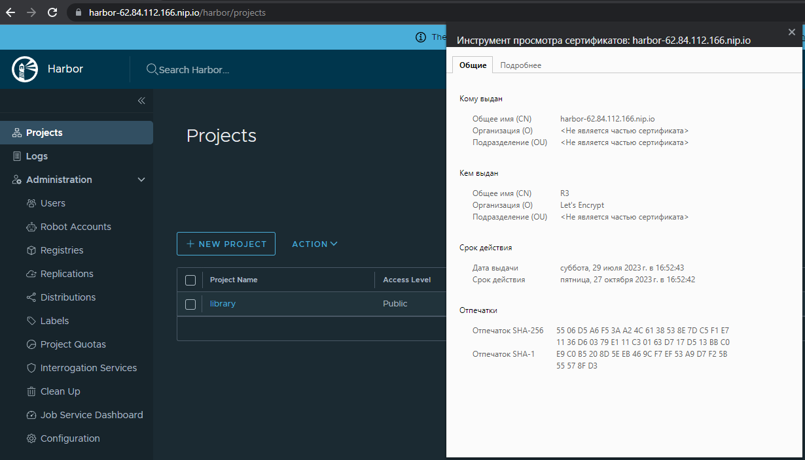
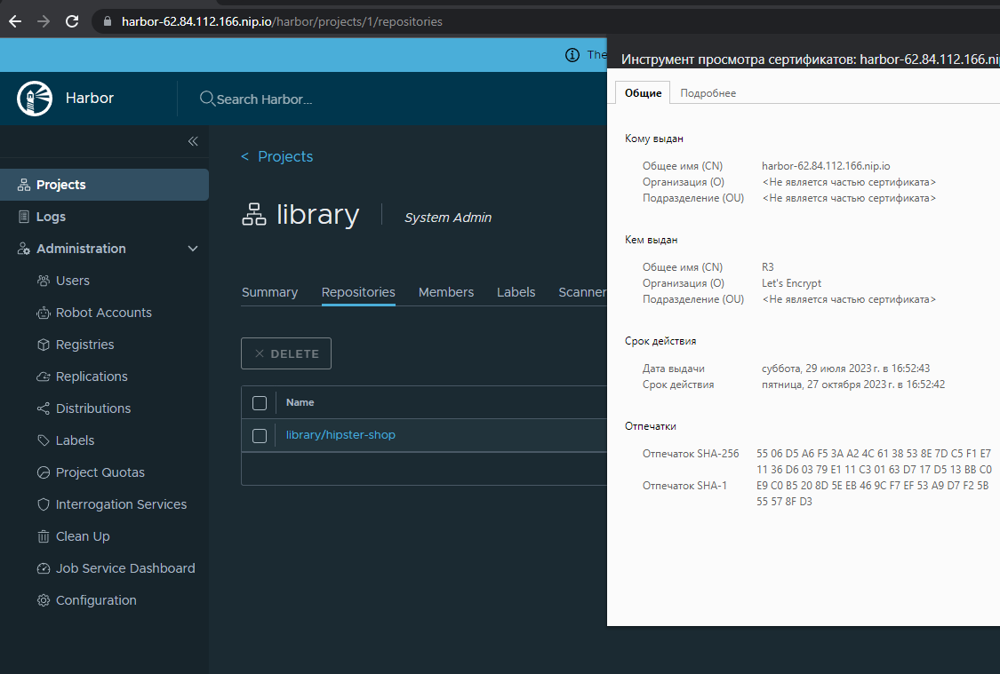
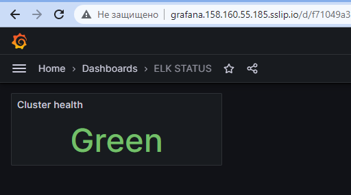

# m-gavrilyuk_platform
m-gavrilyuk Platform repository
через kubectl logs frontend увидел что не задана переменная "PRODUCT_CATALOG_SERVICE_ADDR"
затем в файле манифеста из гитхаба взял список переменных и добавил к себе 


#HARBOR 
```bash
helm repo add harbor https://helm.goharbor.io
helm upgrade  harbor  harbor/harbor --set harborAdminPassword=admin --set expose.ingress.hosts.core=harbor-62.84.112.166.nip.io --set expose.type=ingress
```

#chartmuseum
```bash
helm repo add chartmuseum https://chartmuseum.github.io/charts
helm install my-chartmuseum chartmuseum/chartmuseum --version 3.1.0
```



#Kubernetes-logging
##Elasticsearch
[Kibana](http://kibana.158.160.55.185.sslip.io/)
```bash
 kubectl create ns observability
 helm install elastic oci://registry-1.docker.io/bitnamicharts/elasticsearch --set global.kibanaEnabled=true -n observability
```
##Fluentbit
```bash
helm repo add fluent https://fluent.github.io/helm-charts
helm upgrade --install fluent-bit fluent/fluent-bit --set serviceMonitor.enabled=true -n observability
```
В конфигмапе для otput добавлен сервис эластика 

    [OUTPUT]
        Name es
        Match host.*
        Host elastic-elasticsearch
        Port 9200
        Logstash_Format On
        Logstash_Prefix node
        Retry_Limit False
        Suppress_Type_Name On


#[Grafana](http://grafana.158.160.55.185.sslip.io/?orgId=1)
```bash
helm repo add grafana https://grafana.github.io/helm-charts
helm -n observability  install grafana  grafana/grafana --set ingress.enabled=true  --set ingress.hosts="your-host.sslip.io"
```
###Prometheus-elk-exporter
```bash
helm upgrade --install elasticsearch-exporter stable/elasticsearch-exporter --set
es.uri=http://elastic-elasticsearch:9200 --set serviceMonitor.enabled=true
--namespace=observability
```
