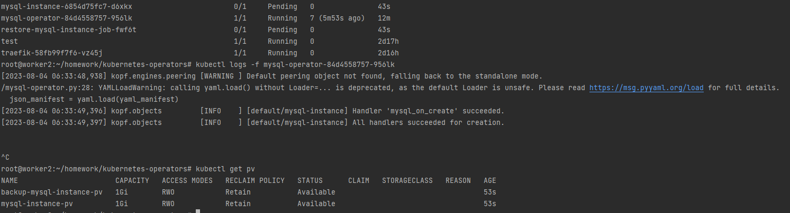

# m-gavrilyuk_platform
m-gavrilyuk Platform repository
через kubectl logs frontend увидел что не задана переменная "PRODUCT_CATALOG_SERVICE_ADDR"
затем в файле манифеста из гитхаба взял список переменных и добавил к себе 


#HARBOR 
```bash
helm repo add harbor https://helm.goharbor.io
helm upgrade  harbor  harbor/harbor --set harborAdminPassword=admin --set expose.ingress.hosts.core=harbor-62.84.112.166.nip.io --set expose.type=ingress
```

#chartmuseum
```bash
helm repo add chartmuseum https://chartmuseum.github.io/charts
helm install my-chartmuseum chartmuseum/chartmuseum --version 3.1.0
```


#kubernetes-operators

